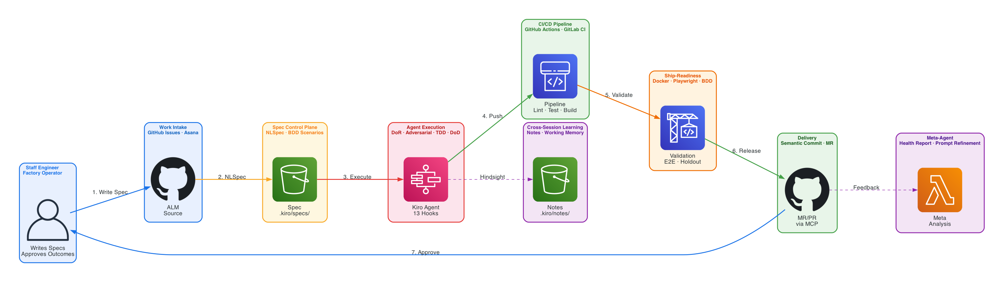

# Forward Deployed Engineer — Autonomous Code Factory

### GenAI powered by Kiro

> From reactive code writer to autonomous engineering partner.
> The Staff Engineer writes specs. The factory ships code.

[]()
[-blue)]()
[]()

---

## What Is This?

This repo is a **factory template** for enterprise-grade AI-assisted software development using [Amazon Kiro](https://kiro.dev). It implements the Autonomous Code Factory pattern (Level 4 autonomy) where AI agents handle the full development loop — writing, testing, reviewing, and packaging code — while the human engineer operates as **Factory Operator**, writing specs and approving outcomes.

The pattern is built on **Forward Deployed Engineers (FDEs)** — AI agents deployed into a project's specific context: its pipeline architecture, its knowledge artifacts, its quality standards, and its governance boundaries. An FDE is not a general-purpose coding assistant. It is an engineering partner that knows your system.

## The Operating Model

```
Staff Engineer writes spec → Agent generates tests → Human approves tests
  → Agent implements (makes tests green) → Adversarial gate challenges each write
    → CI/CD validates → Ship-readiness (Docker + E2E + holdout scenarios)
      → Agent opens MR → Human approves outcome → Code ships
```

The Staff Engineer:
- **Writes specs** (the control plane — what should exist)
- **Approves test contracts** (the halting condition — when is it done)
- **Approves outcomes** (the MR — does it serve the user)
- **Never writes implementation code**
- **Never reviews diffs line-by-line** (automated gates handle correctness)

## Empirical Results

Same task, same AI agent. Without FDE protocol: **33%** quality score. With FDE protocol: **100%** quality score.

```
FDE wins: 12 criteria  |  Bare wins: 0  |  Ties: 6
Improvement: +67 percentage points
```

## Architecture



> Spine: Staff Engineer → ALM → Spec → Agent Execution → CI/CD → Ship-Readiness → Delivery → Staff Engineer approves outcome.
> Branches: Cross-session learning (notes) and meta-agent (prompt refinement).

Each workspace is a **production line** for a specific codebase. The Staff Engineer manages multiple lines simultaneously, routing work and approving outcomes.

```
~/.kiro/ (GLOBAL — universal laws, shared credentials, cross-project knowledge)
    |
    +-- WORKSPACE A ---- Spec in -> Ship-ready MR out
    +-- WORKSPACE B ---- Spec in -> Ship-ready MR out
    +-- WORKSPACE C ---- Spec in -> Ship-ready MR out
```

## Quick Start

### 1. Global setup (one-time)

```bash
git clone https://github.com/truerocha/forward-deployed-engineer-pattern.git ~/factory-template
cd ~/factory-template
bash scripts/provision-workspace.sh --global
```

### 2. Onboard a project

```bash
cd ~/projects/my-project
bash ~/factory-template/scripts/provision-workspace.sh --project
# Then customize .kiro/steering/fde.md for YOUR project
```

### 3. Activate in Kiro

```
#fde Execute the spec in .kiro/specs/my-feature.md
```

See [docs/guides/fde-adoption-guide.md](docs/guides/fde-adoption-guide.md) for the full walkthrough with Next.js and Python microservice examples.

## The 13 Hooks

| Hook | Event | Purpose | Level |
|------|-------|---------|-------|
| fde-dor-gate | preTaskExecution | Readiness validation | L3+ |
| fde-adversarial-gate | preToolUse (write) | Challenge each write | L2+ |
| fde-dod-gate | postTaskExecution | Conformance validation | L3+ |
| fde-pipeline-validation | postTaskExecution | Pipeline testing + 5W2H + report | L3+ |
| fde-test-immutability | preToolUse (write) | VETO writes to approved tests | L2+ |
| fde-circuit-breaker | postToolUse (shell) | Error classification (code compared to environment) | L2+ |
| fde-enterprise-backlog | postTaskExecution | ALM sync (GitHub Issues / Asana) | L3+ |
| fde-enterprise-docs | postTaskExecution | ADR generation + hindsight notes | L3+ |
| fde-enterprise-release | userTriggered | Semantic commit + MR through MCP | L3+ |
| fde-ship-readiness | userTriggered | Docker + E2E + Playwright + holdout | L3+ |
| fde-alternative-exploration | userTriggered | 2 approaches for L4 architectural tasks | L4 |
| fde-notes-consolidate | userTriggered | Archive old notes, merge duplicates | L3+ |
| fde-prompt-refinement | userTriggered | Meta-agent: factory health + prompt improvements | L3+ |

## Repo Structure

```
forward-deployed-engineer-pattern/
+-- .kiro/                          # Factory template (copy to your projects)
|   +-- steering/                   # Protocol + enterprise context
|   +-- hooks/                      # 13 hooks (4 V2 + 9 V3)
|   +-- specs/                      # Working memory + holdout templates
|   +-- notes/                      # Cross-session learning structure
|   +-- meta/                       # Human feedback + refinement log
|   +-- settings/                   # MCP config template
+-- docs/
|   +-- architecture/               # System diagram + design document (DDR)
|   +-- adr/                        # 7 Architecture Decision Records
|   +-- flows/                      # 10 Mermaid feature flow diagrams
|   +-- blueprint/                  # V3 blueprint + artifacts + deploy guide
|   +-- design/                     # V2 design document (research foundations)
|   +-- guides/                     # Adoption guide with walkthroughs
|   +-- global-steerings/           # Templates for ~/.kiro/steering/
+-- examples/
|   +-- web-app/                    # Example: FDE for a web application
|   +-- data-pipeline/              # Example: FDE for a data pipeline
+-- scripts/
|   +-- provision-workspace.sh      # Automated onboarding (--global | --project)
|   +-- generate_architecture_diagram.py
|   +-- lint_language.py
+-- tests/
    +-- test_fde_e2e_protocol.py    # Structural E2E test (48 tests)
    +-- test_fde_quality_threshold.py # Quality comparison test (6 tests)
```

## Research Foundations

The pattern draws from six peer-reviewed studies:

1. **Esposito et al. (2025)** — 93% of GenAI architecture studies lack formal validation
2. **Vandeputte et al. (2025)** — Verification at all levels, not only unit tests
3. **Shonan Meeting 222 (2025)** — Greenfield does not generalize to brownfield
4. **DiCuffa et al. (2025)** — "Context and Instruction" is the most efficient prompt pattern (p<10 to the negative 32)
5. **Bhandwaldar et al. (2026)** — Agent scaling yields 8.27x mean speedup with 10 agents
6. **Wong et al. (2026)** — Agent scaffolding matters as much as model capability (CCA: 59% on SWE-Bench-Pro)

## Running the Tests

```bash
python3 -m pytest tests/ -v
python3 scripts/lint_language.py docs/design/forward-deployed-ai-engineers.md
```

## CI/CD Integration

The factory integrates with GitHub Actions and GitLab CI Ultimate (through mirror). Agents work on feature branches. They never merge, deploy, or modify CI config.

---

## Documentation Index

| Document | Purpose | Start Here If... |
|----------|---------|-----------------|
| [Adoption Guide](docs/guides/fde-adoption-guide.md) | Setup + first task walkthrough | You want to start using the factory today |
| [Blueprint](docs/blueprint/fde-blueprint-design.md) | Full architecture (16 sections) | You want to understand the design decisions |
| [Hook Deploy Guide](docs/blueprint/fde-hooks-deploy-guide.md) | Exact JSON for all 13 hooks | You want to deploy or customize hooks |
| [Design Document](docs/architecture/design-document.md) | Requirements, components, information flow | You want the formal tech design |
| [Feature Flows](docs/flows/README.md) | 10 Mermaid diagrams | You want to see how each feature works |
| [ADRs](docs/adr/) | 7 Architecture Decision Records | You want to understand why decisions were made |
| [V2 Design Doc](docs/design/forward-deployed-ai-engineers.md) | Research foundations | You want the academic grounding |
| [Blogpost](docs/blogpost-autonomous-code-factory.md) | Public summary | You want to share with your team |

### Code to Docs Cross-Reference

| Code Artifact | Documentation |
|--------------|---------------|
| `.kiro/hooks/fde-adversarial-gate.kiro.hook` | [ADR-003](docs/adr/ADR-003-agentic-tdd-halting-condition.md), [Flow 04](docs/flows/04-adversarial-gate.md) |
| `.kiro/hooks/fde-circuit-breaker.kiro.hook` | [ADR-004](docs/adr/ADR-004-circuit-breaker-error-classification.md), [Flow 05](docs/flows/05-circuit-breaker.md) |
| `.kiro/hooks/fde-test-immutability.kiro.hook` | [ADR-003](docs/adr/ADR-003-agentic-tdd-halting-condition.md), [Flow 03](docs/flows/03-agentic-tdd.md) |
| `.kiro/hooks/fde-enterprise-release.kiro.hook` | [ADR-006](docs/adr/ADR-006-enterprise-alm-integration.md), [Flow 07](docs/flows/07-enterprise-release.md) |
| `.kiro/hooks/fde-ship-readiness.kiro.hook` | [Flow 06](docs/flows/06-ship-readiness.md) |
| `.kiro/hooks/fde-enterprise-docs.kiro.hook` | [ADR-007](docs/adr/ADR-007-cross-session-learning-notes.md), [Flow 08](docs/flows/08-cross-session-learning.md) |
| `.kiro/hooks/fde-prompt-refinement.kiro.hook` | [Flow 09](docs/flows/09-meta-agent.md) |
| `.kiro/steering/fde.md` | [V2 Design Doc](docs/design/forward-deployed-ai-engineers.md), [Blueprint](docs/blueprint/fde-blueprint-design.md) |
| `scripts/provision-workspace.sh` | [Adoption Guide](docs/guides/fde-adoption-guide.md) |

---

## License

MIT

## Contributing

PRs welcome. If you apply the Forward Deployed Engineer pattern to your project and have results to share, open an issue.
