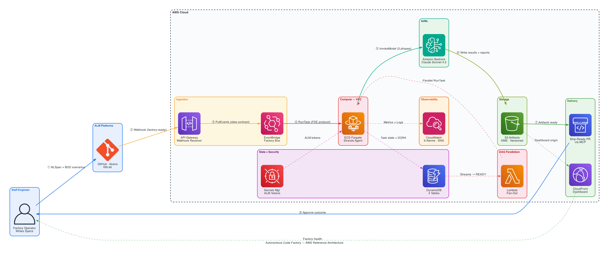

# Autonomous Code Factory

> You write the spec. The factory ships the code.

An enterprise-grade pattern for AI-driven software development where **AI agents handle the full engineering loop** — planning, coding, testing, reviewing, and delivering — while the human engineer operates as the architect and approver.

[]()
[]()
[]()
[]()
[]()
[]()

---

## The Problem

AI coding assistants today are reactive: you prompt, they generate, you review line-by-line, you fix, you prompt again. This doesn't scale beyond one project. It produces locally correct changes that cascade into system-level issues. The human remains the bottleneck.

## The Solution

The Autonomous Code Factory inverts the model. The human defines **what** (specs, acceptance criteria). The factory handles **how** (implementation, testing, delivery). Quality is enforced by automated gates, not manual review.

```
Spec → Tests (human approves) → Implementation → Adversarial Review → CI/CD → PR → Ship
```

**The Staff Engineer:**
- Writes specs (what should exist)
- Approves test contracts (when is it done)
- Approves outcomes (does it serve the user)
- Never writes implementation code
- Never reviews diffs line-by-line

---

## Results

Same task, same AI model. Without the factory protocol: **33%** quality. With it: **100%**.

```
Factory wins: 12 criteria  |  Bare AI wins: 0  |  Ties: 6
Improvement: +67 percentage points
```

---

## How It Works

### 1. Forward Deployed Engineers (FDEs)

Not general-purpose assistants. AI agents deployed into **your project's specific context** — its architecture, its test patterns, its quality standards, its governance rules. An FDE knows your system before it writes a line of code.

### 2. Predictive Risk Scoring

Before any agent executes, a **Bayesian Risk Engine** calculates `P(Failure|Context)` using 18 signals (code complexity, DORA metrics, failure history, design quality, reasoning divergence, coordination overhead). High-risk tasks are blocked or escalated automatically. The engine self-improves via gradient descent on outcomes.

### 3. SWE Synapses — Design Intelligence

Five cognitive design principles (grounded in peer-reviewed research) fire before the Conductor generates a plan. They determine whether to plan or explore (Ralph 2013), whether decomposition is cost-justified (Homay 2025), whether agent responsibilities are deep enough (Ousterhout), whether the architectural bundle is coherent (Wei 2026), and what the system actually knows about the domain (King & Kimble 2004). Two additional synapses (6: Transparency, 7: Deterministic Harness) provide runtime governance. The result: prescriptive guidance instead of reactive gating.

### 4. AI-DLC Alignment & Multi-Platform Support

The factory implements the [AI-DLC methodology](https://github.com/awslabs/aidlc-workflows) and exports its rules to **6 platforms** (Kiro, Q Developer, Cursor, Cline, Claude Code, Copilot). An **Extension Opt-In System** (`fde-profile.json`) lets teams tune FDE intensity per project — from minimal (DoR + DoD only) to strict (all gates + all extensions). Optional **Brown-Field Elevation** and **DDD Design Phase** inject domain modeling steps before code generation for complex tasks.

### 4. Dynamic Agent Squads

A **Conductor** (inspired by Nielsen et al., ICLR 2026) composes specialized agent teams per task — security reviewers, architects, developers, adversarial testers — matched to complexity. Simple bugfixes get 3 agents. Complex features get 8.

### 5. Distributed Execution

Each agent runs as an independent ECS task with its own resources, logs, and retry policy. Parallel stages. Agent-level failure isolation. Instant rollback between monolith and distributed modes.

### 6. Automated Quality Gates

18 hooks enforce quality at every step: test immutability, adversarial challenges, circuit breakers, pipeline validation, ship-readiness checks. No code ships without passing the full gate chain.

---

## Architecture



Five modular planes:

| Plane | What It Does |
|-------|-------------|
| **Version Source Management** | Git, ALM platforms, project isolation, PR delivery |
| **FDE (Agent)** | Autonomy resolution, agent composition, pipeline execution |
| **Context** | Constraint extraction, prompt registry, scope boundaries |
| **Data** | Event routing, task queue, artifact storage |
| **Control** | SDLC gates, DORA metrics, risk scoring, failure classification |

> [Full reference architecture](docs/architecture/reference-architecture.png) — all AWS services, data flows, and integration points.

---

## Quick Start

```bash
# 1. Clone and validate your environment
git clone https://github.com/truerocha/forward-deployed-engineer-pattern.git
cd forward-deployed-engineer-pattern
bash scripts/pre-flight-fde.sh

# 2. Validate ALM connectivity (GitHub / GitLab / Asana)
bash scripts/validate-deploy-fde.sh

# 3. Deploy the factory to your project
bash scripts/code-factory-setup.sh

# 4. Start working
# Move items to "In Progress" on your board, or:
#fde Execute the spec in .kiro/specs/my-feature.md
```

See the [Adoption Guide](docs/guides/fde-adoption-guide.md) for a full walkthrough.

---

## Cloud Deployment (Optional)

When deployed to AWS, the factory runs headless:

```
ALM Webhook → API Gateway → EventBridge → ECS Fargate (Strands Agent + Bedrock) → PR
```

Infrastructure is defined in `infra/terraform/` — ECR, ECS Fargate, Bedrock, DynamoDB, S3, Lambda, CloudFront, Secrets Manager. Deploy with `terraform apply`.

---

## What's Inside

```
forward-deployed-engineer-pattern/
├── .kiro/                    # Factory template (hooks, steering, specs)
├── docs/
│   ├── architecture/         # System diagrams + design document
│   ├── adr/                  # 33 Architecture Decision Records
│   ├── flows/                # 15 feature flow diagrams (Mermaid)
│   ├── blueprint/            # Full blueprint + deploy guide
│   └── guides/               # Adoption guide, auth setup, deployment
├── src/core/                 # Core engine (risk, orchestration, governance, metrics)
├── infra/
│   ├── terraform/            # AWS IaC
│   ├── docker/               # Agent containers + 28 agent modules
│   └── portal-src/           # Observability dashboard (React)
├── scripts/                  # Setup, validation, deployment
└── tests/                    # 1078+ tests
```

---

## Key Capabilities

| Capability | Description | ADR |
|-----------|-------------|-----|
| Agentic TDD | Tests generated from spec, then implementation makes them green | [ADR-003](docs/adr/ADR-003-agentic-tdd-halting-condition.md) |
| Circuit Breaker | Classifies errors as CODE vs ENVIRONMENT — never patches infra bugs | [ADR-004](docs/adr/ADR-004-circuit-breaker-error-classification.md) |
| Multi-Workspace | Manage 3+ projects simultaneously from one factory | [ADR-005](docs/adr/ADR-005-multi-workspace-factory-topology.md) |
| Enterprise ALM | GitHub Projects, Asana, GitLab Ultimate via MCP | [ADR-006](docs/adr/ADR-006-enterprise-alm-integration.md) |
| Cross-Session Learning | Knowledge persists across tasks via structured notes | [ADR-007](docs/adr/ADR-007-cross-session-learning-notes.md) |
| Repo Onboarding | Phase 0: scans any repo (Magika + tree-sitter), generates steering | [ADR-015](docs/adr/ADR-015-repo-onboarding-phase-zero.md) |
| Branch Evaluation | 7-dimension scoring, veto rules, auto-merge for safe changes | [ADR-018](docs/adr/ADR-018-branch-evaluation-agent.md) |
| Dynamic Squads | Task-adaptive agent composition (3-8 agents per task) | [ADR-019](docs/adr/ADR-019-agentic-squad-architecture.md) |
| Conductor | RL-inspired workflow planning with focused subtask instructions | [ADR-020](docs/adr/ADR-020-conductor-orchestration-pattern.md) |
| Risk Inference | Bayesian P(Failure\|Context) with self-improving weights | [ADR-022](docs/adr/ADR-022-risk-inference-engine.md) |
| DORA Forecast | Predictive DORA metrics with EWMA projection | [ADR-023](docs/adr/ADR-023-dora-forecast-engine.md) |
| SWE Synapses | 7 cognitive design principles for agent architecture | [ADR-024](docs/adr/ADR-024-swe-synapses-cognitive-architecture.md) |
| Review Feedback Loop | ICRL closed-loop learning from human PR reviews | [ADR-027](docs/adr/ADR-027-review-feedback-loop.md) |
| Cognitive Autonomy | Depth-calibrated autonomy with trust-building | [ADR-029](docs/adr/ADR-029-cognitive-autonomy-model.md) |
| Cloudscape Portal | AWS Cloudscape Design System observability dashboard | [ADR-031](docs/adr/ADR-031-cloudscape-ux-reformulation.md) |
| Extension Opt-In | Per-project FDE intensity tuning via fde-profile.json | [ADR-032](docs/adr/ADR-032-fde-extension-opt-in-system.md) |
| DDD Design Phase | Brown-field elevation + domain modeling before code gen | [ADR-033](docs/adr/ADR-033-brownfield-elevation-ddd-design-phase.md) |

---

## Quality Gates

The factory enforces quality through 18 event-driven hooks:

| Category | What They Enforce |
|----------|-------------------|
| **Quality Gates** | Readiness before execution, conformance after |
| **Safety** | No unchallenged writes, no test tampering, no infra-as-code bugs |
| **Delivery** | Semantic commits, Docker+E2E validation, ALM updates |
| **Intelligence** | Architectural options, self-improvement, drift detection |
| **Onboarding** | Codebase reasoning, merge gates, structural invariants |

<details>
<summary>Full hook table</summary>

| Hook | Event | Purpose |
|------|-------|---------|
| fde-dor-gate | preTaskExecution | Readiness validation |
| fde-adversarial-gate | preToolUse (write) | Challenge each write |
| fde-dod-gate | postTaskExecution | Conformance validation |
| fde-pipeline-validation | postTaskExecution | Pipeline testing + 5W2H |
| fde-test-immutability | preToolUse (write) | VETO writes to approved tests |
| fde-circuit-breaker | postToolUse (shell) | Error classification |
| fde-enterprise-backlog | postTaskExecution | ALM sync |
| fde-enterprise-docs | postTaskExecution | ADR + hindsight notes |
| fde-enterprise-release | userTriggered | Semantic commit + MR |
| fde-work-intake | userTriggered | Scan boards, create specs |
| fde-ship-readiness | userTriggered | Docker + E2E + holdout |
| fde-alternative-exploration | userTriggered | 2 approaches for L4 tasks |
| fde-notes-consolidate | userTriggered | Archive old notes |
| fde-prompt-refinement | userTriggered | Meta-agent improvements |
| fde-doc-gardening | userTriggered | Documentation drift detection |
| fde-golden-principles | userTriggered | Structural invariants |
| fde-repo-onboard | userTriggered | Phase 0 codebase reasoning |
| fde-branch-eval | userTriggered | Branch evaluation + auto-merge |

</details>

---

## Research Foundations

Built on six peer-reviewed studies:

1. **Esposito et al. (2025)** — 93% of GenAI architecture studies lack formal validation
2. **Vandeputte et al. (2025)** — Verification at all levels, not only unit tests
3. **Shonan Meeting 222 (2025)** — Greenfield does not generalize to brownfield
4. **DiCuffa et al. (2025)** — "Context and Instruction" is the most efficient prompt pattern
5. **Bhandwaldar et al. (2026)** — Agent scaling yields 8.27x mean speedup with 10 agents
6. **Nielsen et al. (2026)** — RL Conductor outperforms all manually-designed multi-agent pipelines

---

## Documentation

| Start Here If... | Document |
|-----------------|----------|
| You want to use the factory today | [Adoption Guide](docs/guides/fde-adoption-guide.md) |
| You want to deploy cloud infra | [Deployment Setup](docs/guides/deployment-setup.md) |
| You want to understand the design | [Design Document](docs/architecture/design-document.md) |
| You want to see feature flows | [15 Flow Diagrams](docs/flows/README.md) |
| You want decision rationale | [33 ADRs](docs/adr/) |

---

## Running Tests

```bash
python3 -m pytest tests/ -v          # Full suite (1078+ tests)
python3 scripts/run_tests.py         # All scopes (knowledge, contract, portal-ui)
python3 scripts/validate_fde_profile.py  # Validate FDE profile
python3 scripts/export_fde_rules.py --verify  # Verify multi-platform rule sync
```

---

## License

MIT

## Contributing

PRs welcome. If you apply the Autonomous Code Factory pattern to your project and have results to share, open an issue.
