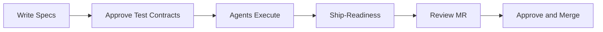
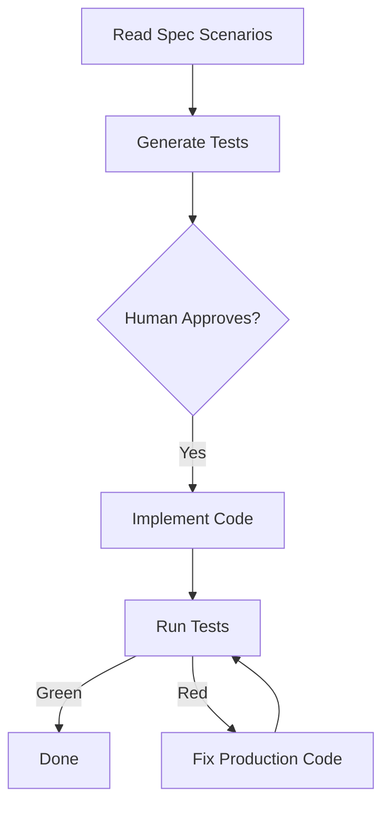
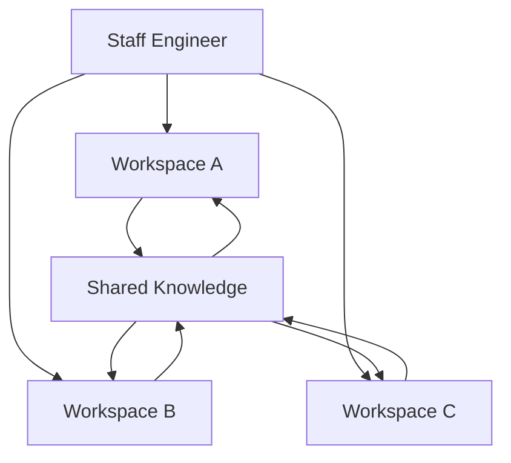

# I Stopped Writing Code. My AI Agents Ship 3 Projects in Parallel.


> What I learned building real systems with an Autonomous Code Factory powered by Kiro.

*Disclaimer: The ideas, analyses, and conclusions presented here reflect my personal views as a technology professional and must not be interpreted as official statements from any employer, current or former.*


---

## The Shift

Six months ago, I spent my days writing code, reviewing diffs, and context-switching between three projects. I was the bottleneck. Every pull request waited for my eyes. Every bug waited for my hands.

Today, I write specifications. AI agents write the code, generate the tests, validate the pipeline, and open merge requests. I review outcomes, not diffs. Three projects run in parallel. The agents work while I architect the next milestone.

This is not a future vision. This is my operating model today, built on [Amazon Kiro](https://kiro.dev) and an open-source pattern called the **Forward Deployed Engineer**.

## What Is a Forward Deployed Engineer?

A Forward Deployed Engineer (FDE) is an AI agent deployed into a specific project's context. It knows your pipeline architecture, your quality standards, your module boundaries, and your governance rules. It is not a general-purpose coding assistant.

Think of it this way: a coding assistant answers questions. A Forward Deployed Engineer executes engineering work within your system's constraints.

The difference in quality is measurable. Same task, same AI model:

```
Without FDE protocol:  33% quality score
With FDE protocol:    100% quality score
Improvement:          +67 percentage points
```

## How the Factory Works

The factory operates on four design principles inspired by how neural networks process information. These are not neuroscience claims — they are engineering metaphors that map to concrete implementation patterns:

**Every component has rigid inputs and outputs.** A workspace receives a specification and produces a merge request. No ambiguity in between.

**Context transmission is clean and minimal.** The agent receives only what it needs for the current task — not everything the project has ever produced.

**Successful patterns strengthen over time.** The factory accumulates knowledge across sessions. Patterns that work get promoted. Patterns that do not get archived.

**The human decides WHAT. The agent decides HOW.** If I am deciding how to implement something, the factory is operating below its target level. If the agent is deciding what to build, the factory has lost control.

Here is the daily rhythm:



> See the full [Work Intake Flow](https://github.com/truerocha/forward-deployed-engineer-pattern/blob/main/docs/flows/01-work-intake.md) and [Agentic TDD Flow](https://github.com/truerocha/forward-deployed-engineer-pattern/blob/main/docs/flows/03-agentic-tdd.md) for detailed Mermaid diagrams.

## The 13 Quality Gates

The factory enforces quality through 13 hooks that fire at specific moments in the engineering lifecycle:

**Before the agent starts**: A Definition of Ready gate validates that the specification is complete and the agent has identified applicable quality standards.

**Before every write operation**: An adversarial gate challenges the agent with eight questions — about downstream consumers, parallel paths, root cause analysis, and domain validation. Every write is questioned before execution.

**After every shell command**: A circuit breaker classifies errors as code issues (the agent can fix) or environment issues (I must fix). This prevents the agent from modifying correct code while trying to fix an infrastructure problem.

**After task completion**: A Definition of Done gate validates conformance. Enterprise hooks sync progress to GitHub Issues and Asana. A documentation hook generates Architecture Decision Records and hindsight notes for cross-session learning.

**On my trigger**: Ship-readiness runs Docker E2E, Playwright browser tests, BDD scenarios, and holdout tests the agent never saw during implementation. The release hook creates semantic commits and opens merge requests through MCP integration.

> See the full [Adversarial Gate Flow](https://github.com/truerocha/forward-deployed-engineer-pattern/blob/main/docs/flows/04-adversarial-gate.md) and [Ship-Readiness Flow](https://github.com/truerocha/forward-deployed-engineer-pattern/blob/main/docs/flows/06-ship-readiness.md).

## The Halting Condition

The most important design decision: **tests are the halting condition**.

The agent generates tests from my specification scenarios before writing any production code. I approve the tests — not the implementation. Once approved, the tests are immutable. The agent cannot modify them to make the build pass.

The agent has one objective: make the approved tests pass while satisfying all constraints. This prevents scope creep, over-engineering, and hallucinated features.



> See [ADR-003: Agentic TDD as Halting Condition](https://github.com/truerocha/forward-deployed-engineer-pattern/blob/main/docs/adr/ADR-003-agentic-tdd-halting-condition.md) for the full decision record.

## Managing Three Projects in Parallel

Each project is a separate Kiro workspace — a production line in the factory. Global laws (TDD mandate, adversarial protocol) apply to all workspaces. Project-specific context (pipeline chain, quality standards) lives in each workspace.

Knowledge flows across projects. When the agent discovers a generic insight in Project A (an error pattern, a tool convention), it writes a shared note that agents in Projects B and C can consult.



> See [ADR-005: Multi-Workspace Factory Topology](https://github.com/truerocha/forward-deployed-engineer-pattern/blob/main/docs/adr/ADR-005-multi-workspace-factory-topology.md) and the [Multi-Workspace Flow](https://github.com/truerocha/forward-deployed-engineer-pattern/blob/main/docs/flows/10-multi-workspace.md).

## Research Foundations

This is not improvisation. The pattern draws from six peer-reviewed studies:

- **93% of GenAI architecture studies lack formal validation** (Esposito et al., 2025) — our Definition of Done gate addresses this gap.
- **Agent scaffolding matters as much as model capability** (Wong et al., 2026) — a weaker model with strong scaffolding outperformed a stronger model with weak scaffolding on SWE-Bench-Pro.
- **The "Context and Instruction" prompt pattern is the most efficient** (DiCuffa et al., 2025, p < 10 to the negative 32) — our structured intake contract implements this pattern.
- **Scaling from 1 to 10 agents yields 8.27x mean speedup** (Bhandwaldar et al., 2026) — informing our alternative exploration hook for architectural decisions.

## Getting Started

The factory template is open source. Setup takes 15 minutes:

```bash
git clone https://github.com/truerocha/forward-deployed-engineer-pattern.git
bash scripts/provision-workspace.sh --global
cd ~/projects/your-project
bash ~/forward-deployed-engineer-pattern/scripts/provision-workspace.sh --project
```

The [adoption guide](https://github.com/truerocha/forward-deployed-engineer-pattern/blob/main/docs/guides/fde-adoption-guide.md) includes walkthroughs for Next.js applications and Python microservices, a detailed daily operating rhythm, and 15 troubleshooting scenarios.

## The Code Is the Output. The Specification Is the Product.

The factory does not replace engineering judgment. I write the specifications that define what the system does. I approve the outcomes that determine what ships. I provide feedback that improves the factory over time.

What changed is where I spend my time. I moved from writing implementation code to writing specifications and approving outcomes. The agents handle the rest.

The specification is the product. The code is the output.


---

**Repository**: [github.com/truerocha/forward-deployed-engineer-pattern](https://github.com/truerocha/forward-deployed-engineer-pattern)

**Documentation**: [Architecture](https://github.com/truerocha/forward-deployed-engineer-pattern/blob/main/docs/architecture/design-document.md) | [Flows](https://github.com/truerocha/forward-deployed-engineer-pattern/blob/main/docs/flows/README.md) | [ADRs](https://github.com/truerocha/forward-deployed-engineer-pattern/tree/main/docs/adr) | [Adoption Guide](https://github.com/truerocha/forward-deployed-engineer-pattern/blob/main/docs/guides/fde-adoption-guide.md)
