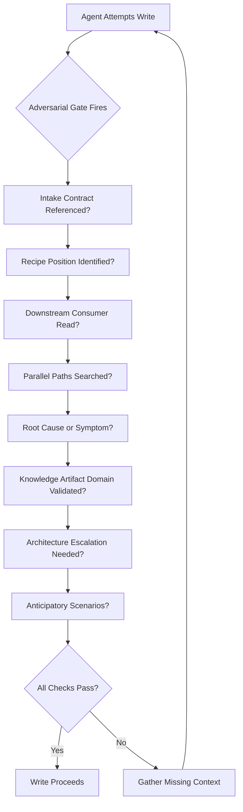

# Adversarial Gate Flow

```mermaid
flowchart TD
    WRITE[Agent Attempts Write] --> GATE{Adversarial Gate Fires}
    GATE --> Q1[Intake Contract Referenced?]
    Q1 --> Q2[Recipe Position Identified?]
    Q2 --> Q3[Downstream Consumer Read?]
    Q3 --> Q4[Parallel Paths Searched?]
    Q4 --> Q5[Root Cause or Symptom?]
    Q5 --> Q6[Knowledge Artifact Domain Validated?]
    Q6 --> Q7[Architecture Escalation Needed?]
    Q7 --> Q8[Anticipatory Scenarios?]
    Q8 --> DECIDE{All Checks Pass?}
    DECIDE -->|Yes| PROCEED[Write Proceeds]
    DECIDE -->|No| GATHER[Gather Missing Context]
    GATHER --> WRITE
```
