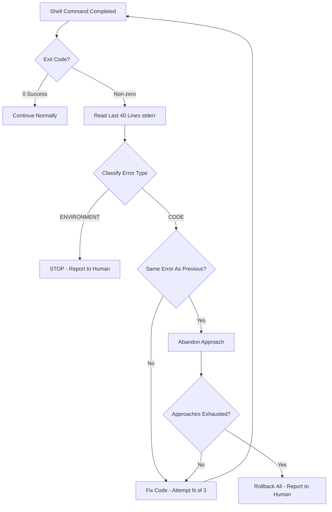

# Circuit Breaker Flow

```mermaid
flowchart TD
    CMD[Shell Command Completed] --> EXIT{Exit Code?}
    EXIT -->|0 Success| CONTINUE[Continue Normally]
    EXIT -->|Non-zero| READ[Read Last 40 Lines stderr]
    READ --> CLASSIFY{Classify Error Type}
    CLASSIFY -->|ENVIRONMENT| STOP[STOP - Report to Human]
    CLASSIFY -->|CODE| SAME{Same Error As Previous?}
    SAME -->|Yes| ABANDON[Abandon Approach]
    SAME -->|No| FIX[Fix Code - Attempt N of 3]
    FIX --> CMD
    ABANDON --> APPROACH{Approaches Exhausted?}
    APPROACH -->|No| FIX
    APPROACH -->|Yes| ROLLBACK[Rollback All - Report to Human]
```
