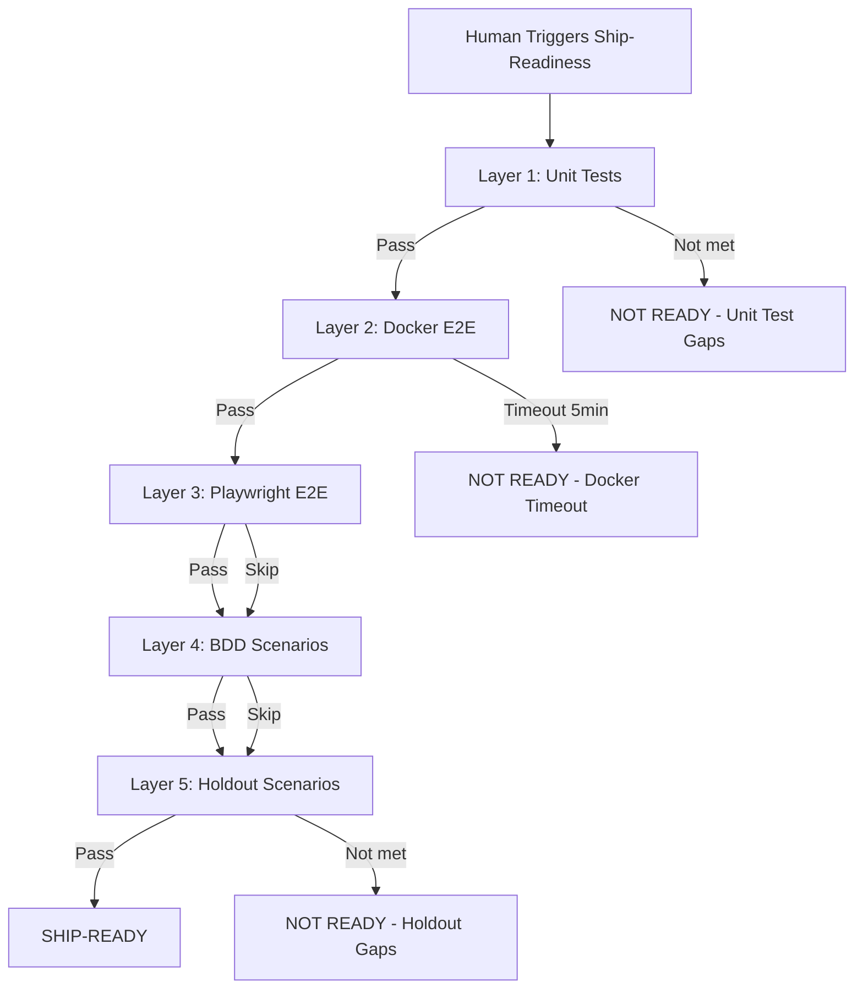

# Ship-Readiness Flow

```mermaid
flowchart TD
    TRIGGER[Human Triggers Ship-Readiness] --> UNIT[Layer 1: Unit Tests]
    UNIT -->|Pass| DOCKER[Layer 2: Docker E2E]
    UNIT -->|Not met| REPORT1[NOT READY - Unit Test Gaps]
    DOCKER -->|Pass| PW[Layer 3: Playwright E2E]
    DOCKER -->|Timeout 5min| REPORT2[NOT READY - Docker Timeout]
    PW -->|Pass| BDD[Layer 4: BDD Scenarios]
    PW -->|Skip| BDD
    BDD -->|Pass| HOLDOUT[Layer 5: Holdout Scenarios]
    BDD -->|Skip| HOLDOUT
    HOLDOUT -->|Pass| READY[SHIP-READY]
    HOLDOUT -->|Not met| REPORT3[NOT READY - Holdout Gaps]
```
