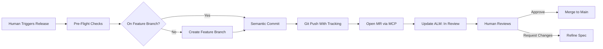

# Enterprise Release Flow

```mermaid
flowchart LR
    TRIGGER[Human Triggers Release] --> PRE[Pre-Flight Checks]
    PRE --> BRANCH{On Feature Branch?}
    BRANCH -->|No| CREATE[Create Feature Branch]
    BRANCH -->|Yes| COMMIT[Semantic Commit]
    CREATE --> COMMIT
    COMMIT --> PUSH[Git Push With Tracking]
    PUSH --> MR[Open MR via MCP]
    MR --> ALM[Update ALM: In Review]
    ALM --> HUMAN[Human Reviews]
    HUMAN -->|Approve| MERGE[Merge to Main]
    HUMAN -->|Request Changes| REFINE[Refine Spec]
```
