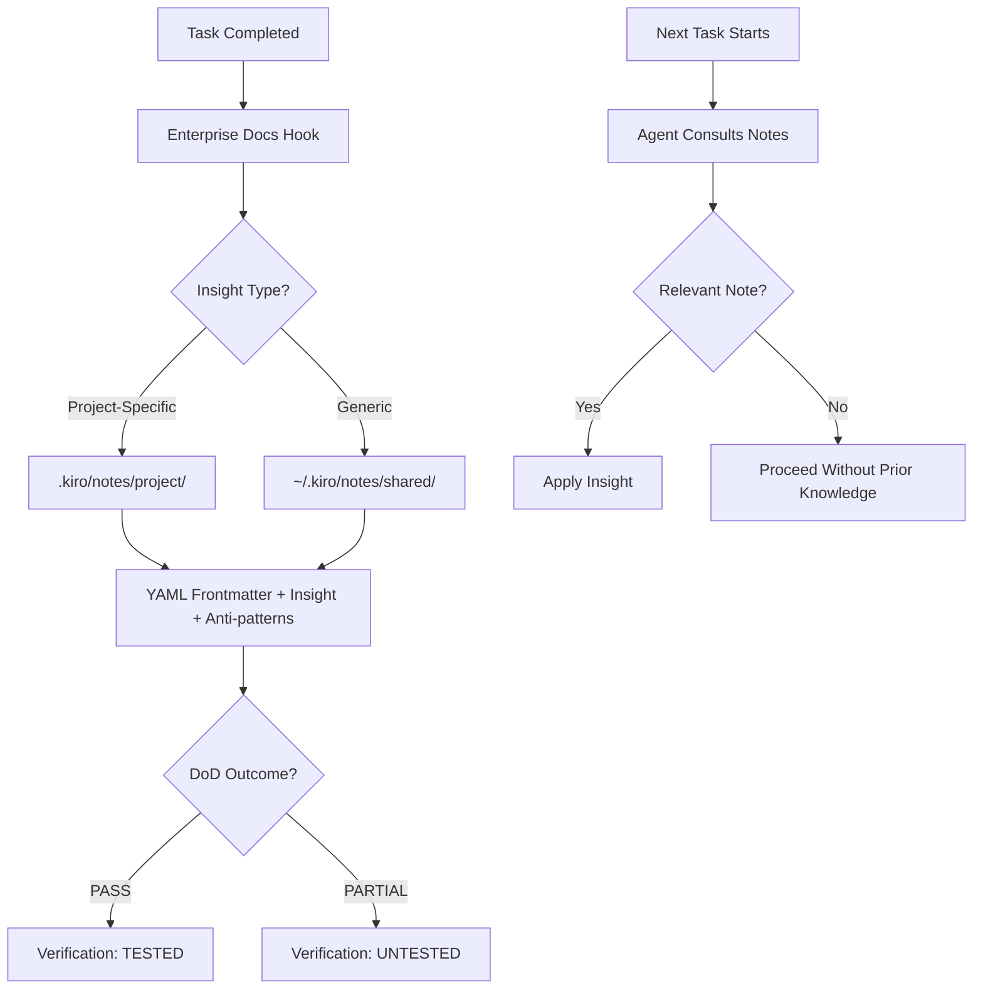

# Cross-Session Learning Flow

```mermaid
flowchart TD
    TASK[Task Completed] --> DOCS[Enterprise Docs Hook]
    DOCS --> TYPE{Insight Type?}
    TYPE -->|Project-Specific| LOCAL[.kiro/notes/project/]
    TYPE -->|Generic| GLOBAL[~/.kiro/notes/shared/]
    LOCAL --> FORMAT[YAML Frontmatter + Insight + Anti-patterns]
    GLOBAL --> FORMAT
    FORMAT --> VERIFY{DoD Outcome?}
    VERIFY -->|PASS| TESTED[Verification: TESTED]
    VERIFY -->|PARTIAL| UNTESTED[Verification: UNTESTED]
    NEXT[Next Task Starts] --> CONSULT[Agent Consults Notes]
    CONSULT --> RELEVANT{Relevant Note?}
    RELEVANT -->|Yes| APPLY[Apply Insight]
    RELEVANT -->|No| PROCEED[Proceed Without Prior Knowledge]
```
