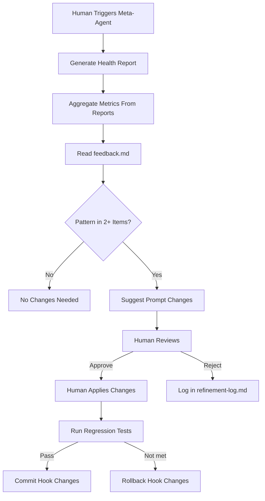

# Meta-Agent Flow

```mermaid
flowchart TD
    TRIGGER[Human Triggers Meta-Agent] --> HEALTH[Generate Health Report]
    HEALTH --> METRICS[Aggregate Metrics From Reports]
    METRICS --> FEEDBACK[Read feedback.md]
    FEEDBACK --> THRESHOLD{Pattern in 2+ Items?}
    THRESHOLD -->|No| NONE[No Changes Needed]
    THRESHOLD -->|Yes| SUGGEST[Suggest Prompt Changes]
    SUGGEST --> REVIEW[Human Reviews]
    REVIEW -->|Approve| APPLY[Human Applies Changes]
    REVIEW -->|Reject| LOG[Log in refinement-log.md]
    APPLY --> TEST[Run Regression Tests]
    TEST -->|Pass| COMMIT[Commit Hook Changes]
    TEST -->|Not met| ROLLBACK[Rollback Hook Changes]
```
