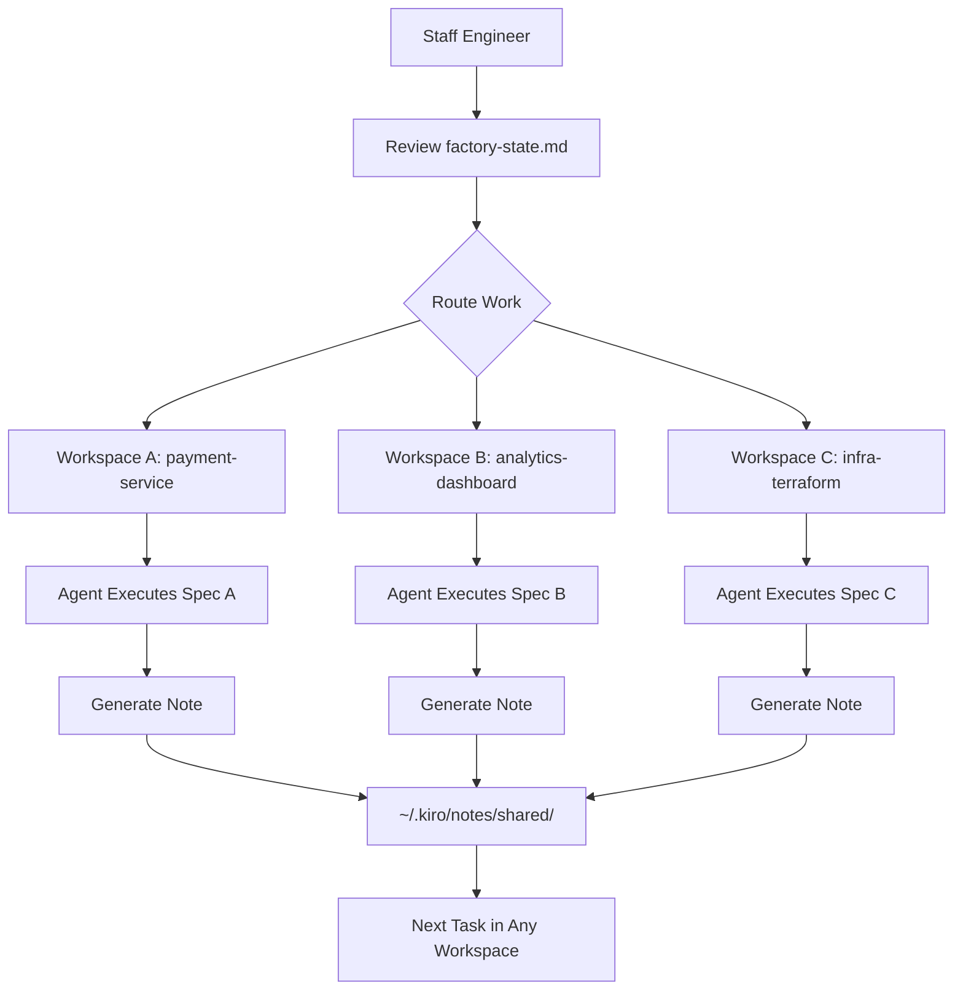

# Multi-Workspace Orchestration Flow

```mermaid
flowchart TD
    SE[Staff Engineer] --> STATE[Review factory-state.md]
    STATE --> ROUTE{Route Work}
    ROUTE --> WA[Workspace A: payment-service]
    ROUTE --> WB[Workspace B: analytics-dashboard]
    ROUTE --> WC[Workspace C: infra-terraform]
    WA --> EXECA[Agent Executes Spec A]
    WB --> EXECB[Agent Executes Spec B]
    WC --> EXECC[Agent Executes Spec C]
    EXECA --> NOTEA[Generate Note]
    EXECB --> NOTEB[Generate Note]
    EXECC --> NOTEC[Generate Note]
    NOTEA --> SHARED[~/.kiro/notes/shared/]
    NOTEB --> SHARED
    NOTEC --> SHARED
    SHARED --> NEXT[Next Task in Any Workspace]
```
