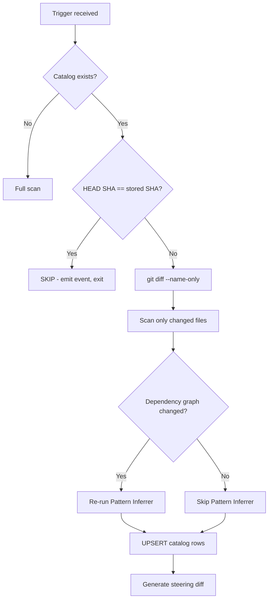

# Flow 14: Repo Onboarding (Phase 0)

> The Phase 0 pipeline that scans a repository and generates project-specific FDE steering.

## Trigger Modes

| Mode | Trigger | Source |
|------|---------|--------|
| Cloud | EventBridge `fde.onboarding.requested` | Staff Engineer or automation |
| Cloud | Direct ECS RunTask with `REPO_URL` env var | CI/CD pipeline |
| Local | Kiro hook `fde-repo-onboard` (userTriggered) | Staff Engineer in IDE |

## Flow Diagram

```mermaid
%%{init: {'flowchart': {'rankSpacing': 60, 'nodeSpacing': 40}}}%%
flowchart LR
    subgraph Trigger["1. Trigger Handler"]
        T1[Receive Event]
        T2{Mode?}
        T3{Catalog exists &<br/>SHA unchanged?}
    end

    subgraph Clone["2. Repo Cloner"]
        C1[Fetch token<br/>from Secrets Manager]
        C2[git clone --depth 1<br/>via GIT_ASKPASS]
        C3[Discard token]
    end

    subgraph Scan["3. File Scanner"]
        S1[Walk filesystem]
        S2[Classify with Magika]
        S3[Detect generated files]
    end

    subgraph AST["4. AST Extractor"]
        A1[Parse with tree-sitter]
        A2[Extract imports]
        A3[Build dependency graph]
    end

    subgraph Conv["5. Convention Detector"]
        CV1[Check config files]
        CV2[Detect frameworks]
    end

    subgraph Infer["6. Pattern Inferrer"]
        I1[Build structured summary]
        I2[Invoke Haiku ≤8K tokens]
        I3[Parse JSON response]
    end

    subgraph Write["7. Catalog Writer"]
        W1[Create/update SQLite]
        W2[Write 9 tables]
    end

    subgraph Steer["8. Steering Generator"]
        ST1[Render pipeline chain]
        ST2[Render boundaries]
        ST3[Generate diff]
    end

    subgraph Persist["9. S3 Persister"]
        P1[Upload catalog.db]
        P2[Upload steering-draft.md]
        P3[Upload steering-diff.md]
    end

    T1 --> T2
    T2 -->|cloud| T3
    T2 -->|local| S1
    T3 -->|unchanged| SKIP[SKIP - emit event]
    T3 -->|changed| C1
    C1 --> C2 --> C3 --> S1
    S1 --> S2 --> S3 --> A1
    A1 --> A2 --> A3 --> CV1
    CV1 --> CV2 --> I1
    I1 --> I2 --> I3 --> W1
    W1 --> W2 --> ST1
    ST1 --> ST2 --> ST3 --> P1
    P1 --> P2 --> P3 --> DONE[Done]

    style SKIP fill:#fff3e0,stroke:#ef6c00
    style DONE fill:#e8f5e9,stroke:#43a047
```

## Stage Details

| Stage | Component | Input | Output | Skip Condition |
|-------|-----------|-------|--------|----------------|
| 1 | Trigger Handler | Event/env vars | TriggerContext | — |
| 2 | Repo Cloner | repo_url, credentials | cloned workspace, commit SHA | Local mode |
| 3 | File Scanner | workspace path | FileRecord list | — |
| 4 | AST Extractor | source file paths | ModuleSignature list, ImportEdge list | — |
| 5 | Convention Detector | file paths | Convention list | — |
| 6 | Pattern Inferrer | structured summary | pipeline_chain, boundaries, tech_stack, level_patterns | Incremental (no graph changes) |
| 7 | Catalog Writer | all extracted data | catalog.db (SQLite) | — |
| 8 | Steering Generator | catalog data | fde-draft.md + diff | — |
| 9 | S3 Persister | local artifacts | S3 URIs | Local mode |

## Incremental Re-scan Flow

## Human Approval Gate

The generated steering is **never auto-applied**. The Staff Engineer:

1. Reviews `steering-draft.md` (cloud: in S3, local: at `.kiro/steering/fde-draft.md`)
2. Optionally reviews `steering-diff.md` (shows what changed since last scan)
3. Copies/renames to `.kiro/steering/fde.md` to activate

## Error Handling

- **Partial results preserved**: If the pipeline fails mid-way, completed stages' outputs are still written to the catalog
- **Failure report**: Written to `catalogs/{owner}/{repo}/failure-report.json` in S3
- **Dead-letter queue**: ECS task failures caught by existing DLQ + CloudWatch alarm
- **Graceful degradation**: Unparseable files are skipped (logged as parse errors), pipeline continues

## Observability

| Metric | Namespace | Alarm Threshold |
|--------|-----------|-----------------|
| `stage_duration` | fde/onboarding | P99 > 120s per stage |
| `total_duration` | fde/onboarding | > 300s (5 min budget) |
| `llm_cost` | fde/onboarding | > $0.01 per run |
| `error_count` | fde/onboarding | > 0 |
| `scan_file_count` | fde/onboarding | > 100,000 (sampling triggered) |

## Related

- [ADR-015: Repo Onboarding Phase Zero](../adr/ADR-015-repo-onboarding-phase-zero.md)
- [Design Document](../../.kiro/specs/repo-onboarding-agent/design.md)
- [Cloud Orchestration Flow](13-cloud-orchestration.md)
