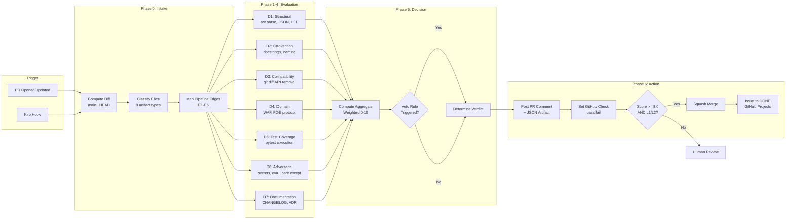

# Flow 15: Branch Evaluation Gate

> Automated quality scoring and merge decision for feature branches.

## Trigger

- **GitHub Action**: PR opened, synchronized, or reopened
- **Kiro Hook**: `fde-branch-eval` (userTriggered)
- **Orchestrator**: After `push_and_create_pr()` completes

## Flow

## Scoring Model

| Dimension | Weight | Veto Threshold |
|-----------|--------|----------------|
| Structural Validity | 20% | < 3 |
| Convention Compliance | 15% | — |
| Backward Compatibility | 20% | < 3 |
| Domain Alignment | 15% | < 3 |
| Test Coverage | 15% | — |
| Adversarial Resilience | 10% | — |
| Documentation | 5% | — |

## Verdicts

| Score | Verdict | Merge | Auto-Merge |
|-------|---------|-------|------------|
| >= 8.0 | PASS | Yes | Yes (L1/L2) |
| 7.0-7.9 | CONDITIONAL PASS | Yes | No |
| 5.0-6.9 | CONDITIONAL FAIL | No | No |
| < 5.0 | FAIL | No | No |

## Issue Lifecycle (Post-Merge)

After successful auto-merge:
1. Close issue via REST API (state: closed, state_reason: completed)
2. Move to DONE via GraphQL (updateProjectV2ItemFieldValue mutation)

## Related

- [ADR-018](../adr/ADR-018-branch-evaluation-agent.md) — Architecture decision
- [Design Doc](../design/branch-evaluation-agent.md) — Full specification
- [Flow 04](04-adversarial-gate.md) — Adversarial gate (D6 formalizes this)
- [Flow 06](06-ship-readiness.md) — Ship readiness (evaluation is the automated equivalent)
